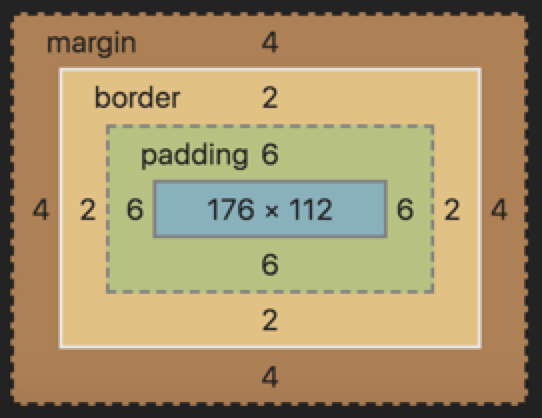
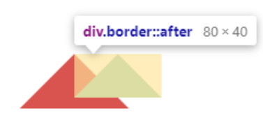
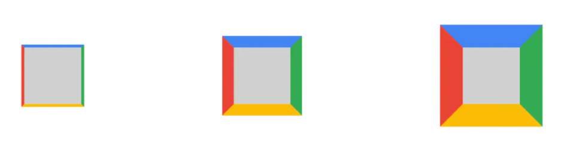
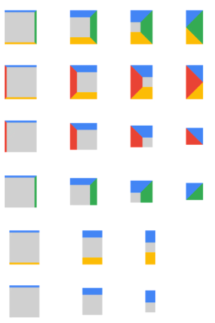
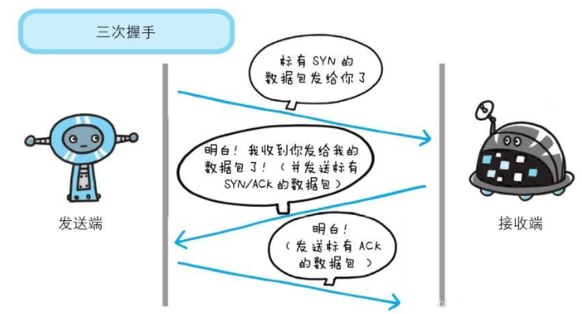
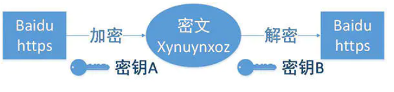
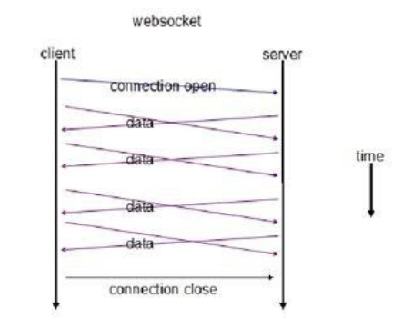

<h1 align="center">2021版全栈升实训面试题库v2.0</h1>


​	

​																**编写人：全栈全体项目经理**

<div style="page-break-after: always;"></div>

<h1 align="center">目  录</h1>

[toc]

<div style="page-break-after: always;"></div>

## 一、HTML&CSS

### 	1.1 H5新增特性和css3新增特性？

```
答： 1.首先 html5 为了更好的实践 web 语义化，增加了 header，footer，nav,aside,section 等语义 化标签，
	  2.在表单方面，为了增强表单，为 input 增加了 color，email,data ,range 等类型， 
	  3.在存储方面，提供了 sessionStorage，localStorage,和离线存储，通过这些存储方式方便数 据在客户端的存储和获取，
	  4.在多媒体方面规定了音频和视频元素 audio 和 vedio，另外还 有地理定位，canvas 画布，拖放，多线程编程的 web worker 和 websocket协议
	  5.css3新增特性：
	  		CSS3 边框如 border-radius，box-shadow 等;
	  		CSS3 背景如 background-size，background-origin 等;
	  		CSS3 2D，3D 转换如 transform 等;
	  		CSS3 动画如 animation 等
	  
```

### 	1.2  BFC的理解？

```
答：1.BFC（Block Formatting Context），即块级格式化上下文，它是页面中的一块渲染区域，并且有一套属于自己的渲染规则：

- 内部的盒子会在垂直方向上一个接一个的放置
- 对于同一个BFC的俩个相邻的盒子的margin会发生重叠，与方向无关。
- 每个元素的左外边距与包含块的左边界相接触（从左到右），即使浮动元素也是如此
- BFC的区域不会与float的元素区域重叠
- 计算BFC的高度时，浮动子元素也参与计算
- BFC就是页面上的一个隔离的独立容器，容器里面的子元素不会影响到外面的元素，反之亦然

BFC目的是形成一个相对于外界完全独立的空间，让内部的子元素不会影响到外部的元素

  2.触发BFC的条件包含不限于：

- 根元素，即HTML元素
- 浮动元素：float值为left、right
- overflow值不为 visible，为 auto、scroll、hidden
- display的值为inline-block、inltable-cell、table-caption、table、inline-table、flex、inline-flex、grid、inline-grid
- position的值为absolute或fixed
  3.利用BFC的特性，我们将`BFC`应用在以下场景：
  	防止margin重叠（塌陷）
  	清除内部浮动
  	自适应多栏布局
```


### 	1.3 说说你对盒模型的理解？

答：

- 盒模型其实就是浏览器把一个个标签都看一个矩形盒子，那每个盒子（即标签）都会有内容(width,height)，边框(border)，以及内容和边框中间的缝隙（即内间距padding），还有盒子与盒子之间的外间距（即margin）,用图表示为：



 

- 当然盒模型包括两种：IE盒模型和w3c标准盒模型

      IE盒模型总宽度即就是width宽度=border+padding+内容宽度
        
      标准盒模型总宽度＝border+padding+width

    那如何在IE盒模型宽度和标准盒模型总宽度之间切换呢，可以通过box-sizing:border-box或设置成content-box来切换

      其中：box-sizing：border-box  //IE盒模型

​    		 box-sizing：content-box  //w3c盒模型


### 	1.4 如何实现元素水平垂直居中？

答：居中是一个非常基础但又是非常重要的应用场景，实现居中的方法存在很多，可以将这些方法分成两个大类：

- 居中元素（子元素）的宽高已知

- 居中元素宽高未知

- 实现方式：

    - ### 利用定位+margin:auto

    先上代码：

    ```html
    <style>
        .father{
            width:500px;
            height:300px;
            border:1px solid #0a3b98;
            position: relative;
        }
        .son{
            width:100px;
            height:40px;
            background: #f0a238;
            position: absolute;
            top:0;
            left:0;
            right:0;
            bottom:0;
            margin:auto;
        }
    </style>
    <div class="father">
        <div class="son"></div>
    </div>
    ```

    父级设置为相对定位，子级绝对定位 ，并且四个定位属性的值都设置了0，那么这时候如果子级没有设置宽高，则会被拉开到和父级一样宽高

    这里子元素设置了宽高，所以宽高会按照我们的设置来显示，但是实际上子级的虚拟占位已经撑满了整个父级，这时候再给它一个`margin：auto`它就可以上下左右都居中了

    

    ### 利用定位+margin:负值

    绝大多数情况下，设置父元素为相对定位， 子元素移动自身50%实现水平垂直居中

    ```html
    <style>
        .father {
            position: relative;
            width: 200px;
            height: 200px;
            background: skyblue;
        }
        .son {
            position: absolute;
            top: 50%;
            left: 50%;
            margin-left:-50px;
            margin-top:-50px;
            width: 100px;
            height: 100px;
            background: red;
        }
    </style>
    <div class="father">
        <div class="son"></div>
    </div>
    ```

    整个实现思路如下图所示：

     

    - 初始位置为方块1的位置
    - 当设置left、top为50%的时候，内部子元素为方块2的位置
    - 设置margin为负数时，使内部子元素到方块3的位置，即中间位置

    这种方案不要求父元素的高度，也就是即使父元素的高度变化了，仍然可以保持在父元素的垂直居中位置，水平方向上是一样的操作

    但是该方案需要知道子元素自身的宽高，但是我们可以通过下面`transform`属性进行移动

    

    ### 利用定位+transform

    实现代码如下：

    ```css
    <style>
        .father {
            position: relative;
            width: 200px;
            height: 200px;
            background: skyblue;
        }
        .son {
            position: absolute;
            top: 50%;
            left: 50%;
      transform: translate(-50%,-50%);
            width: 100px;
            height: 100px;
            background: red;
        }
    </style>
    <div class="father">
        <div class="son"></div>
    </div>
    ```

    `translate(-50%, -50%)`将会将元素位移自己宽度和高度的-50%

    这种方法其实和最上面被否定掉的margin负值用法一样，可以说是`margin`负值的替代方案，并不需要知道自身元素的宽高

    

    

    ### table布局

    设置父元素为`display:table-cell`，子元素设置 `display: inline-block`。利用`vertical`和`text-align`可以让所有的行内块级元素水平垂直居中

    ```html
    <style>
        .father {
            display: table-cell;
            width: 200px;
            height: 200px;
            background: skyblue;
            vertical-align: middle;
            text-align: center;
        }
        .son {
            display: inline-block;
            width: 100px;
            height: 100px;
            background: red;
        }
    </style>
    <div class="father">
        <div class="son"></div>
    </div>
    ```

    

    ### flex弹性布局

    还是看看实现的整体代码：

    ```html
    <style>
        .father {
            display: flex;
            justify-content: center;
            align-items: center;
            width: 200px;
            height: 200px;
            background: skyblue;
        }
        .son {
            width: 100px;
            height: 100px;
            background: red;
        }
    </style>
    <div class="father">
        <div class="son"></div>
    </div>
    ```

    `css3`中了`flex`布局，可以非常简单实现垂直水平居中

    这里可以简单看看`flex`布局的关键属性作用：

    - display: flex时，表示该容器内部的元素将按照flex进行布局

    - align-items: center表示这些元素将相对于本容器水平居中
    - justify-content: center也是同样的道理垂直居中

    

    ### grid网格布局

    ```html
    <style>
        .father {
                display: grid;
                align-items:center;
                justify-content: center;
                width: 200px;
                height: 200px;
                background: skyblue;
    
            }
            .son {
                width: 10px;
                height: 10px;
                border: 1px solid red
            }
    </style>
    <div class="father">
        <div class="son"></div>
    </div>
    ```

    这里看到，`gird`网格布局和`flex`弹性布局都简单粗暴

    

    ### 小结

    上述方法中，不知道元素宽高大小仍能实现水平垂直居中的方法有：

    - 利用定位+margin:auto
    - 利用定位+transform

    - 利用定位+margin:负值

    - flex布局

    - grid布局


### 	1.5 如何实现两栏布局，右侧自适应？三栏布局中间自适应呢？

答：

- 两栏布局

    - 方法一：实现思路也非常的简单：
        - 使用 float 左浮左边栏
        - 右边模块使用 margin-left 撑出内容块做内容展示
        - 为父级元素添加BFC，防止下方元素飞到上方内容

    代码如下：

    ```html
    <style>
        .box{
            overflow: hidden; 添加BFC
        }
        .left {
            float: left;
            width: 200px;
            background-color: gray;
            height: 400px;
        }
        .right {
            margin-left: 210px;
            background-color: lightgray;
            height: 200px;
        }
    </style>
    <div class="box">
        <div class="left">左边</div>
        <div class="right">右边</div>
    </div>
    ```

    还有一种更为简单的使用则是采取：flex弹性布局

    - 方法二：flex弹性布局

    ```html
    <style>
        .box{
            display: flex;
        }
        .left {
            width: 100px;
        }
        .right {
            flex: 1;
        }
    </style>
    <div class="box">
        <div class="left">左边</div>
        <div class="right">右边</div>
    </div>
    ```

    `flex`可以说是最好的方案了，代码少，使用简单

    注意的是，`flex`容器的一个默认属性值:`align-items: stretch;`

    这个属性导致了列等高的效果。 为了让两个盒子高度自动，需要设置: `align-items: flex-start`

- 三栏布局

    - 实现三栏布局中间自适应的布局方式有：

        - 两边使用 float，中间使用 margin

        ```
        需要将中间的内容放在html结构最后，否则右侧会臣在中间内容的下方
        
        实现代码如下：
        
        ​```html
        <style>
            .wrap {
                background: #eee;
                overflow: hidden; <!-- 生成BFC，计算高度时考虑浮动的元素 -->
                padding: 20px;
                height: 200px;
            }
            .left {
                width: 200px;
                height: 200px;
                float: left;
                background: coral;
            }
            .right {
                width: 120px;
                height: 200px;
                float: right;
                background: lightblue;
            }
            .middle {
                margin-left: 220px;
                height: 200px;
                background: lightpink;
                margin-right: 140px;
            }
        </style>
        <div class="wrap">
            <div class="left">左侧</div>
            <div class="right">右侧</div>
            <div class="middle">中间</div>
        </div>
        
        
        原理如下：
        
        - 两边固定宽度，中间宽度自适应。
        - 利用中间元素的margin值控制两边的间距
        - 宽度小于左右部分宽度之和时，右侧部分会被挤下去
        
        这种实现方式存在缺陷：
        
        - 主体内容是最后加载的。
        
        - 右边在主体内容之前，如果是响应式设计，不能简单的换行展示
        ```

        

        - 两边使用 absolute，中间使用 margin

        ```
        基于绝对定位的三栏布局：注意绝对定位的元素脱离文档流，相对于最近的已经定位的祖先元素进行定位。无需考虑HTML中结构的顺序
        
        <style>
          .container {
            position: relative;
          }
          
          .left,
          .right,
          .main {
            height: 200px;
            line-height: 200px;
            text-align: center;
          }
        
          .left {
            position: absolute;
            top: 0;
            left: 0;
            width: 100px;
            background: green;
          }
        
          .right {
            position: absolute;
            top: 0;
            right: 0;
            width: 100px;
            background: green;
          }
        
          .main {
            margin: 0 110px;
            background: black;
            color: white;
          }
        </style>
        
        <div class="container">
          <div class="left">左边固定宽度</div>
          <div class="right">右边固定宽度</div>
          <div class="main">中间自适应</div>
        </div>
        
        
        实现流程：
        
        - 左右两边使用绝对定位，固定在两侧。
        - 中间占满一行，但通过 margin和左右两边留出10px的间隔
        ```

        

        - 两边使用 float 和负 margin

        ```
        <style>
          .left,
          .right,
          .main {
            height: 200px;
            line-height: 200px;
            text-align: center;
          }
        
          .main-wrapper {
            float: left;
            width: 100%;
          }
        
          .main {
            margin: 0 110px;
            background: black;
            color: white;
          }
        
          .left,
          .right {
            float: left;
            width: 100px;
            margin-left: -100%;
            background: green;
          }
        
          .right {
            margin-left: -100px; /* 同自身宽度 */
          }
        </style>
        
        <div class="main-wrapper">
          <div class="main">中间自适应</div>
        </div>
        <div class="left">左边固定宽度</div>
        <div class="right">右边固定宽度</div>
        
        实现过程：
        
        - 中间使用了双层标签，外层是浮动的，以便左中右能在同一行展示
        - 左边通过使用负 margin-left:-100%，相当于中间的宽度，所以向上偏移到左侧
        - 右边通过使用负 margin-left:-100px，相当于自身宽度，所以向上偏移到最右侧
        
         
        
        缺点：
        
        - 增加了 .main-wrapper 一层，结构变复杂
        - 使用负 margin，调试也相对麻烦
        ```

        

        - display: table 实现
            - `<table>` 标签用于展示行列数据，不适合用于布局。但是可以使用 `display: table` 来实现布局的效果

        ```
        <style>
          .container {
            height: 200px;
            line-height: 200px;
            text-align: center;
            display: table;
            table-layout: fixed;
            width: 100%;
          }
        
          .left,
          .right,
          .main {
            display: table-cell;
          }
        
          .left,
          .right {
            width: 100px;
            background: green;
          }
        
          .main {
            background: black;
            color: white;
            width: 100%;
          }
        </style>
        
        <div class="container">
          <div class="left">左边固定宽度</div>
          <div class="main">中间自适应</div>
          <div class="right">右边固定宽度</div>
        </div>
        
        实现原理：
        
        - 层通过 display: table设置为表格，设置 table-layout: fixed`表示列宽自身宽度决定，而不是自动计算。
        - 内层的左中右通过 display: table-cell设置为表格单元。
        - 左右设置固定宽度，中间设置 width: 100% 填充剩下的宽度
        ```

        

        - flex实现

            - 利用`flex`弹性布局，可以简单实现中间自适应
            - 代码如下：

            ```
            <style type="text/css">
                .wrap {
                    display: flex;
                    justify-content: space-between;
                }
            
                .left,
                .right,
                .middle {
                    height: 100px;
                }
            
                .left {
                    width: 200px;
                    background: coral;
                }
            
                .right {
                    width: 120px;
                    background: lightblue;
                }
            
                .middle {
                    background: #555;
                    width: 100%;
                    margin: 0 20px;
                }
            </style>
            <div class="wrap">
                <div class="left">左侧</div>
                <div class="middle">中间</div>
                <div class="right">右侧</div>
            </div>
            
            实现过程：
            
            - 仅需将容器设置为`display:flex;`，
            - 盒内元素两端对其，将中间元素设置为`100%`宽度，或者设为`flex:1`，即可填充空白
            - 盒内元素的高度撑开容器的高度
            
            优点：
            
            - 结构简单直观
            - 可以结合 flex的其他功能实现更多效果，例如使用 order属性调整显示顺序，让主体内容优先加载，但展示在中间
            ```

            

        - grid网格布局

            代码如下:

        ```
        <style>
            .wrap {
                display: grid;
                width: 100%;
                grid-template-columns: 300px auto 300px;
            }
        
            .left,
            .right,
            .middle {
                height: 100px;
            }
        
            .left {
                background: coral;
            }
        
            .right {
                width: 300px;
                background: lightblue;
            }
        
            .middle {
                background: #555;
            }
        </style>
        <div class="wrap">
            <div class="left">左侧</div>
            <div class="middle">中间</div>
            <div class="right">右侧</div>
        </div>
        ```

### 	1.6 CSS如何画一个三角形？原理是什么？

答：通常情况下我们会使用图片或者`svg`去完成三角形效果图，但如果单纯使用`css`如何完成一个三角形呢？

实现过程似乎也并不困难，通过边框就可完成

- 实现过程

在以前也讲过盒子模型，默认情况下是一个矩形，实现也很简单

```html
<style>
    .border {
        width: 50px;
        height: 50px;
        border: 2px solid;
        border-color: #96ceb4 #ffeead #d9534f #ffad60;
    }
</style>
<div class="border"></div>
```

效果如下图所示：

 

将`border`设置`50px`，效果图如下所示：

 

白色区域则为`width`、`height`，这时候只需要你将白色区域部分宽高逐渐变小，最终变为0，则变成如下图所示：

 

这时候就已经能够看到4个不同颜色的三角形，如果需要下方三角形，只需要将上、左、右边框设置为0就可以得到下方的红色三角形

 

但这种方式，虽然视觉上是实现了三角形，但实际上，隐藏的部分任然占据部分高度，需要将上方的宽度去掉

最终实现代码如下：

```css
.border {
    width: 0;
    height: 0;
    border-style:solid;
    border-width: 0 50px 50px;
    border-color: transparent transparent #d9534f;
}
```

如果想要实现一个只有边框是空心的三角形，由于这里不能再使用`border`属性，所以最直接的方法是利用伪类新建一个小一点的三角形定位上去

```css
.border {
    width: 0;
    height: 0;
    border-style:solid;
    border-width: 0 50px 50px;
    border-color: transparent transparent #d9534f;
    position: relative;
}
.border:after{
    content: '';
    border-style:solid;
    border-width: 0 40px 40px;
    border-color: transparent transparent #96ceb4;
    position: absolute;
    top: 0;
    left: 0;
}
```

效果图如下所示：

 

伪类元素定位参照对象的内容区域宽高都为0，则内容区域即可以理解成中心一点，所以伪元素相对中心这点定位

将元素定位进行微调以及改变颜色，就能够完成下方效果图：

 

最终代码如下：

```css
.border:after {
    content: '';
    border-style: solid;
    border-width: 0 40px 40px;
    border-color: transparent transparent #96ceb4;
    position: absolute;
    top: 6px;
    left: -40px;
}
```

- 原理分析

可以看到，边框是实现三角形的部分，边框实际上并不是一个直线，如果我们将四条边设置不同的颜色，将边框逐渐放大，可以得到每条边框都是一个梯形

 

当分别取消边框的时候，发现下面几种情况：

- 取消一条边的时候，与这条边相邻的两条边的接触部分会变成直的
- 当仅有邻边时， 两个边会变成对分的三角
- 当保留边没有其他接触时，极限情况所有东西都会消失

 

通过上图的变化规则，利用旋转、隐藏，以及设置内容宽高等属性，就能够实现其他类型的三角形

如设置直角三角形，如上图倒数第三行实现过程，我们就能知道整个实现原理

实现代码如下：

```css
.box {
    /* 内部大小 */
    width: 0px;
    height: 0px;
    /* 边框大小 只设置两条边*/
    border-top: #4285f4 solid;
    border-right: transparent solid;
    border-width: 85px; 
    /* 其他设置 */
    margin: 50px;
}
```


### 	1.7 说说em/px/rem/vh/vw区别?

答：em/px/rem/vh/vw区别如下：

**px**：绝对单位，页面按精确像素展示

**em**：相对单位，基准点为父节点字体的大小，如果自身定义了`font-size`按自身来计算，整个页面内`1em`不是一个固定的值

**rem**：相对单位，可理解为`root em`, 相对根节点`html`的字体大小来计算

**vh、vw**：主要用于页面视口大小布局，在页面布局上更加方便简单

## 三、网络安全

### 	3.1 web常见的攻击方式有哪些？如何防御

答：Web攻击（WebAttack）是针对用户上网行为或网站服务器等设备进行攻击的行为

如植入恶意代码，修改网站权限，获取网站用户隐私信息等等

Web应用程序的安全性是任何基于Web业务的重要组成部分

我们常见的Web攻击方式有

- XSS (Cross Site Scripting) 跨站脚本攻击

```
XSS 即（Cross Site Scripting）中文名称为：跨站脚本攻击。XSS的重点不在于跨站点，而在于脚本的执行。

XSS的原理是：
	恶意攻击者在web页面中会插入一些恶意的script代码。当用户浏览该页面的时候，那么嵌入到web页面中script代码会执行，因此会达到恶意攻击用户的目的。
	XSS攻击最主要有如下分类：反射型、存储型、及 DOM-based型。 反射性和DOM-baseed型可以归类为非持久性XSS攻击。存储型可以归类为持久性XSS攻击
	
	(1)反射型XSS的攻击步骤如下：
    1. 攻击者在url后面的参数中加入恶意攻击代码。
    2. 当用户打开带有恶意代码的URL的时候，网站服务端将恶意代码从URL中取出，拼接在html中并且返回给浏览器端。
    3. 用户浏览器接收到响应后执行解析，其中的恶意代码也会被执行到。
    4. 攻击者通过恶意代码来窃取到用户数据并发送到攻击者的网站。攻击者会获取到比如cookie等信息，然后使用该信息来冒充合法用户的行为，调用目标网站接口执行攻击等操作。
	(2)存储型XSS的攻击步骤如下：
    1. 攻击者将恶意代码提交到目标网站数据库中。
    2. 用户打开目标网站时，网站服务器将恶意代码从数据库中取出，然后拼接到html中返回给浏览器中。
    3. 用户浏览器接收到响应后解析执行，那么其中的恶意代码也会被执行。
    4. 那么恶意代码执行后，就能获取到用户数据，比如上面的cookie等信息，那么把该cookie发送到攻击者网站中，那么攻击者拿到该cookie然后会冒充该用户的行为，调用目标网站接口等违法操作。


(3)DOM型XSS的攻击步骤如下：
    1. 攻击者构造出特殊的URL、在其中可能包含恶意代码。
    2. 用户打开带有恶意代码的URL。
    3. 用户浏览器收到响应后解析执行。前端使用js取出url中的恶意代码并执行。
    4. 执行时，恶意代码窃取用户数据并发送到攻击者的网站中，那么攻击者网站拿到这些数据去冒充用户的行为操作。调用目标网站接口执行攻击者一些操作。

    DOM XSS 是基于文档对象模型的XSS。一般有如下DOM操作：
    1. 使用document.write直接输出数据。
    2. 使用innerHTML直接输出数据。
    3. 使用location、location.href、location.replace、iframe.src、document.referer、window.name等这些。
```


- CSRF（Cross-site request forgery）跨站请求伪造

    CSRF（Cross-site request forgery）跨站请求伪造：攻击者诱导受害者进入第三方网站，在第三方网站中，向被攻击网站发送跨站请求

    利用受害者在被攻击网站已经获取的注册凭证，绕过后台的用户验证，达到冒充用户对被攻击的网站执行某项操作的目

    一个典型的CSRF攻击有着如下的流程：

    - 受害者登录a.com，并保留了登录凭证（Cookie）
    - 攻击者引诱受害者访问了b.com
    - b.com 向 a.com 发送了一个请求：a.com/act=xx。浏览器会默认携带a.com的Cookie
    - a.com接收到请求后，对请求进行验证，并确认是受害者的凭证，误以为是受害者自己发送的请求
    - a.com以受害者的名义执行了act=xx
    - 攻击完成，攻击者在受害者不知情的情况下，冒充受害者，让a.com执行了自己定义的操作

    **CSRF的特点**

    - 攻击一般发起在第三方网站，而不是被攻击的网站。被攻击的网站无法防止攻击发生
    - 攻击利用受害者在被攻击网站的登录凭证，冒充受害者提交操作；而不是直接窃取数据
    - 整个过程攻击者并不能获取到受害者的登录凭证，仅仅是“冒用”
    - 跨站请求可以用各种方式：图片URL、超链接、CORS、Form提交等等。部分请求方式可以直接嵌入在第三方论坛、文章中，难以进行追踪

- SQL注入攻击

```
SQL注入是通过客户端的输入把SQL命令注入到一个应用的数据库中，从而执行恶意的SQL语句。
什么意思呢？我们来打个比方：我们有一个登录框，需要输入用户名和密码对吧，然后我们的密码输入 'or '123' = '123 这样的。
我们在查询用户名和密码是否正确的时候，本来执行的sql语句是：select * from user where username = '' and password = ''. 这样的sql语句，现在我们输入密码是如上这样的，然后我们会通过参数进行拼接，拼接后的sql语句就是：
select * from user where username = '' and password = ' ' or '123' = '123 '; 这样的了，那么会有一个or语句，只要这两个有一个是正确的话，就条件成立，因此 123 = 123 是成立的。因此验证就会被跳过。这只是一个简单的列子，比如还有密码比如是这样的：'; drop table user;, 这样的话，那么sql命令就变成了：
select * from user where username = '' and password = ''; drop table user;' , 那么这个时候我们会把user表直接删除了。

sql被攻击的原因是：sql语句伪造参数，然后对参数进行拼接后形成xss攻击的sql语句。最后会导致数据库被攻击了。

防范的方法：
1. 我们可以使用预编译语句(PreparedStatement，这样的话即使我们使用sql语句伪造成参数，到了服务端的时候，这个伪造sql语句的参数也只是简单的字符，并不能起到攻击的作用。
2. 数据库中密码不应明文存储的，可以对密码使用md5进行加密
```


## 四、网络相关

### 	4.1 说说地址栏输入 URL 敲下回车后发生了什么?

答：**1.简单分析**

简单的分析，从输入 `URL`到回车后发生的行为如下：

- URL解析
- DNS 查询
- TCP 连接
- HTTP 请求
- 响应请求
- 页面渲染

**二、详细分析**

**URL解析**

首先判断你输入的是一个合法的`URL` 还是一个待搜索的关键词，并且根据你输入的内容进行对应操作

`URL`的解析第过程中的第一步，一个`url`的结构解析如下：

 

**DNS查询**

在之前文章中讲过`DNS`的查询，这里就不再讲述了

整个查询过程如下图所示：

 

最终，获取到了域名对应的目标服务器`IP`地址

**TCP连接**

在之前文章中，了解到`tcp`是一种面向有连接的传输层协议

在确定目标服务器服务器的`IP`地址后，则经历三次握手建立`TCP`连接，流程如下：

 

**发送 http 请求**

当建立`tcp`连接之后，就可以在这基础上进行通信，浏览器发送 `http` 请求到目标服务器

请求的内容包括：

- 请求行
- 请求头
- 请求主体

 

**响应请求**

当服务器接收到浏览器的请求之后，就会进行逻辑操作，处理完成之后返回一个`HTTP`响应消息，包括：

- 状态行
- 响应头
- 响应正文

 

在服务器响应之后，由于现在`http`默认开始长连接`keep-alive`，当页面关闭之后，`tcp`链接则会经过四次挥手完成断开

**页面渲染**

当浏览器接收到服务器响应的资源后，首先会对资源进行解析：

- 查看响应头的信息，根据不同的指示做对应处理，比如重定向，存储cookie，解压gzip，缓存资源等等
- 查看响应头的 Content-Type的值，根据不同的资源类型采用不同的解析方式

关于页面的渲染过程如下：

- 解析HTML，构建 DOM 树
- 解析 CSS ，生成 CSS 规则树
- 合并 DOM 树和 CSS 规则，生成 render 树
- 布局 render 树（ Layout / reflow ），负责各元素尺寸、位置的计算
- 绘制 render 树（ paint ），绘制页面像素信息
- 浏览器会将各层的信息发送给 GPU，GPU 会将各层合成（ composite ），显示在屏幕上

 

### 	4.2 说一下 GET 和 POST 的区别？还有哪些提交方式？

答：**1.是什么**

`GET`和`POST`，两者是`HTTP`协议中发送请求的方法

**GET**

`GET`方法请求一个指定资源的表示形式，使用GET的请求应该只被用于获取数据

**POST**

`POST`方法用于将实体提交到指定的资源，通常导致在服务器上的状态变化或**副作用**

本质上都是`TCP`链接，并无差别

但是由于`HTTP`的规定和浏览器/服务器的限制，导致他们在应用过程中会体现出一些区别

**GET和POST区别**

从`w3schools`得到的标准答案的区别如下：

- GET在浏览器回退时是无害的，而POST会再次提交请求。
- GET产生的URL地址可以被Bookmark，而POST不可以。
- GET请求会被浏览器主动cache，而POST不会，除非手动设置。
- GET请求只能进行url编码，而POST支持多种编码方式。
- GET请求参数会被完整保留在浏览器历史记录里，而POST中的参数不会被保留。
- GET请求在URL中传送的参数是有长度限制的，而POST没有。
- 对参数的数据类型，GET只接受ASCII字符，而POST没有限制。
- GET比POST更不安全，因为参数直接暴露在URL上，所以不能用来传递敏感信息。
- GET参数通过URL传递，POST放在Request body中

**参数位置**

貌似从上面看到`GET`与`POST`请求区别非常大，但两者实质并没有区别

无论 `GET `还是 `POST`，用的都是同一个传输层协议，所以在传输上没有区别

当不携带参数的时候，两者最大的区别为第一行方法名不同

> POST /uri HTTP/1.1 \r\n
>
> GET /uri HTTP/1.1 \r\n

当携带参数的时候，我们都知道`GET`请求是放在`url`中，`POST`则放在`body`中

`GET` 方法简约版报文是这样的

```
GET /index.html?name=qiming.c&age=22 HTTP/1.1
Host: localhost
```

`POST `方法简约版报文是这样的

```
POST /index.html HTTP/1.1
Host: localhost
Content-Type: application/x-www-form-urlencoded

name=qiming.c&age=22
```

注意：这里只是约定，并不属于`HTTP`规范，相反的，我们可以在`POST`请求中`url`中写入参数，或者`GET`请求中的`body`携带参数

**参数长度**

`HTTP `协议没有` Body `和 `URL` 的长度限制，对 `URL `限制的大多是浏览器和服务器的原因

`IE`对`URL`长度的限制是2083字节(2K+35)。对于其他浏览器，如Netscape、FireFox等，理论上没有长度限制，其限制取决于操作系统的支持

这里限制的是整个`URL`长度，而不仅仅是参数值的长度

服务器处理长` URL` 要消耗比较多的资源，为了性能和安全考虑，会给 `URL` 长度加限制

**安全**

`POST `比` GET` 安全，因为数据在地址栏上不可见

然而，从传输的角度来说，他们都是不安全的，因为` HTTP` 在网络上是明文传输的，只要在网络节点上捉包，就能完整地获取数据报文

只有使用`HTTPS`才能加密安全

**数据包**

对于`GET`方式的请求，浏览器会把`http header`和`data`一并发送出去，服务器响应200（返回数据）

对于`POST`，浏览器先发送`header`，服务器响应100 `continue`，浏览器再发送`data`，服务器响应200 ok

并不是所有浏览器都会在`POST`中发送两次包，`Firefox`就只发送一次

提交方式除了GET和POST外，还有put和delete，简单解释一下：

- PUT请求是向服务器端发送数据的（与GET不同）从而改变信息，该请求就像数据库的update操作一样，用来修改数据的内容，但是不会增加数据的种类等，也就是说无论进行多少次PUT操作，其结果并没有不同。

- DELETE请求顾名思义，就是用来删除某一个资源的，该请求就像数据库的delete操作。

### 	4.3 什么是HTTP? HTTP 和 HTTPS 的区别?

答：**1.HTTP (HyperText Transfer Protocol)，即超文本运输协议**，是实现网络通信的一种规范

 

在计算机和网络世界有，存在不同的协议，如广播协议、寻址协议、路由协议等等......

而`HTTP`是一个传输协议，即将数据由A传到B或将B传输到A，并且 A 与 B 之间能够存放很多第三方，如： A<=>X<=>Y<=>Z<=>B

传输的数据并不是计算机底层中的二进制包，而是完整的、有意义的数据，如HTML 文件, 图片文件, 查询结果等超文本，能够被上层应用识别

在实际应用中，`HTTP`常被用于在`Web`浏览器和网站服务器之间传递信息，以明文方式发送内容，不提供任何方式的数据加密

特点如下：

- 支持客户/服务器模式

- 简单快速：客户向服务器请求服务时，只需传送请求方法和路径。由于HTTP协议简单，使得HTTP服务器的程序规模小，因而通信速度很快
- 灵活：HTTP允许传输任意类型的数据对象。正在传输的类型由Content-Type加以标记
- 无连接：无连接的含义是限制每次连接只处理一个请求。服务器处理完客户的请求，并收到客户的应答后，即断开连接。采用这种方式可以节省传输时间
- 无状态：HTTP协议无法根据之前的状态进行本次的请求处理

**二、HTTPS**

在上述介绍`HTTP`中，了解到`HTTP`传递信息是以明文的形式发送内容，这并不安全。而`HTTPS`出现正是为了解决`HTTP`不安全的特性

为了保证这些隐私数据能加密传输，让`HTTP`运行安全的`SSL/TLS`协议上，即 HTTPS = HTTP + SSL/TLS，通过 `SSL`证书来验证服务器的身份，并为浏览器和服务器之间的通信进行加密

`SSL` 协议位于` TCP/IP` 协议与各种应用层协议之间，浏览器和服务器在使用 `SSL` 建立连接时需要选择一组恰当的加密算法来实现安全通信，为数据通讯提供安全支持

 

流程图如下所示：

 

- 首先客户端通过URL访问服务器建立SSL连接
- 服务端收到客户端请求后，会将网站支持的证书信息（证书中包含公钥）传送一份给客户端
- 客户端的服务器开始协商SSL连接的安全等级，也就是信息加密的等级
- 客户端的浏览器根据双方同意的安全等级，建立会话密钥，然后利用网站的公钥将会话密钥加密，并传送给网站
- 服务器利用自己的私钥解密出会话密钥
- 服务器利用会话密钥加密与客户端之间的通信

**三、区别**

- HTTPS是HTTP协议的安全版本，HTTP协议的数据传输是明文的，是不安全的，HTTPS使用了SSL/TLS协议进行了加密处理，相对更安全
- HTTP 和 HTTPS 使用连接方式不同，默认端口也不一样，HTTP是80，HTTPS是443
- HTTPS 由于需要设计加密以及多次握手，性能方面不如 HTTP
- HTTPS需要SSL，SSL 证书需要钱，功能越强大的证书费用越高

### 	4.4 http缓存中，强缓存和协商缓存的区别？

答：**浏览器缓存的作用是什么**

- 缓存可以减少冗余的数据传输。节省了网络带宽，从而更快的加载页面。
- 缓存降低了服务器的要求，从而服务器更快的响应

**缓存的资源文件到什么地方去了呢？**

>  那么首先来看下 **memory cache 和 disk cache** 缓存

- **memory cache:** 它是将资源文件缓存到内存中。等下次请求访问的时候不需要重新下载资源，而是直接从内存中读取数据。

- **disk cache:** 它是将资源文件缓存到硬盘中。等下次请求的时候它是直接从硬盘中读取

**浏览器缓存分为2种：强制缓存和协商缓存**

**协商缓存原理：**

- 客户端向服务器端发出请求，服务端会检测是否有对应的标识，如果没有对应的标识，服务器端会返回一个对应的标识给客户端，客户端下次再次请求的时候，把该标识带过去，然后服务器端会验证该标识，如果验证通过了，则会响应304，告诉浏览器读取缓存。如果标识没有通过，则返回请求的资源。

那么协商缓存的标识又有2种：**ETag/if-None-Match 和 Last-Modified/if-Modify-Since**

- **协商缓存Last-Modified/if-Modify-Since**

    浏览器第一次发出请求一个资源的时候，服务器会返回一个last-Modify到hearer中. Last-Modify 含义是最后的修改时间。
    当浏览器再次请求的时候，request的请求头会加上 if-Modify-Since，该值为缓存之前返回的 Last-Modify. 服务器收到if-Modify-Since后，根据资源的最后修改时间(last-Modify)和该值(if-Modify-Since)进行比较，如果相等的话，则命中缓存，返回304，否则, 如果 Last-Modify > if-Modify-Since, 则会给出200响应，并且更新Last-Modify为新的值。

- **协商缓存ETag/if-None-Match**

    ETag的原理和上面的last-modified是类似的。ETag则是对当前请求的资源做一个唯一的标识。该标识可以是一个字符串，文件的size,hash等。只要能够合理标识资源的唯一性并能验证是否修改过就可以了。ETag在服务器响应请求的时候，返回当前资源的唯一标识(它是由服务器生成的)。但是只要资源有变化，ETag会重新生成的。浏览器再下一次加载的时候会向服务器发送请求，会将上一次返回的ETag值放到request header 里的 if-None-Match里面去，服务器端只要比较客户端传来的if-None-Match值是否和自己服务器上的ETag是否一致，如果一致说明资源未修改过，因此返回304，如果不一致，说明修改过，因此返回200。并且把新的Etag赋值给if-None-Match来更新该值。

**last-modified 和 ETag之间对比:**

- 在精度上，ETag要优先于 last-modified。
- 在性能上，Etag要逊于Last-Modified，Last-Modified需要记录时间，而Etag需要服务器通过算法来计算出一个hash值。
-  在优先级上，服务器校验优先考虑Etag

**强缓存**

- **基本原理：**浏览器在加载资源的时候，会先根据本地缓存资源的header中的信息(Expires 和 Cache-Control)来判断是否需要强制缓存。如果命中的话，则会直接使用缓存中的资源。否则的话，会继续向服务器发送请求。

- **Expires**

    Expires 是http1.0的规范，它的值是一个绝对时间的GMT格式的时间字符串。这个时间代表的该资源的失效时间，如果在该时间之前请求的话，则都是从缓存里面读取的。但是使用该规范时，可能会有一个缺点就是当服务器的时间和客户端的时间不一样的情况下，会导致缓存失效

- **Cache-Control**

    **Cache-Control** 是http1.1的规范，它是利用该字段max-age值进行判断的。该值是一个相对时间，比如 **Cache-Control: max-age=3600,** 代表该资源的有效期是3600秒。除了该字段外，我们还有如下字段可以设置：

    **no-cache:** 需要进行协商缓存，发送请求到服务器确认是否使用缓存。

    **no-store：**禁止使用缓存，每一次都要重新请求数据。

    **public：**可以被所有的用户缓存，包括终端用户和 CDN 等中间代理服务器。

    **private：**只能被终端用户的浏览器缓存，不允许 CDN 等中继缓存服务器对其缓存。

    Cache-Control 与 Expires 可以在服务端配置同时启用，同时启用的时候 Cache-Control 优先级高

### 	4.5 说说HTTP 常见的状态码有哪些，适用场景？

答：**一、是什么**

HTTP状态码（英语：HTTP Status Code），用以表示网页服务器超文本传输协议响应状态的3位数字代码

它由 RFC 2616规范定义的，并得到 `RFC 2518`、`RFC 2817`、`RFC 2295`、`RFC 2774`与 `RFC 4918`等规范扩展

简单来讲，`http`状态码的作用是服务器告诉客户端当前请求响应的状态，通过状态码就能判断和分析服务器的运行状态

**二、分类**

状态码第一位数字决定了不同的响应状态，有如下：

- 1 表示消息
- 2 表示成功
- 3 表示重定向
- 4 表示请求错误
- 5 表示服务器错误

**1xx**

代表请求已被接受，需要继续处理。这类响应是临时响应，只包含状态行和某些可选的响应头信息，并以空行结束

常见的有：

- 100（客户端继续发送请求，这是临时响应）：这个临时响应是用来通知客户端它的部分请求已经被服务器接收，且仍未被拒绝。客户端应当继续发送请求的剩余部分，或者如果请求已经完成，忽略这个响应。服务器必须在请求完成后向客户端发送一个最终响应
- 101：服务器根据客户端的请求切换协议，主要用于websocket或http2升级

**2xx**

代表请求已成功被服务器接收、理解、并接受

常见的有：

- 200（成功）：请求已成功，请求所希望的响应头或数据体将随此响应返回
- 201（已创建）：请求成功并且服务器创建了新的资源

- 202（已创建）：服务器已经接收请求，但尚未处理
- 203（非授权信息）：服务器已成功处理请求，但返回的信息可能来自另一来源
- 204（无内容）：服务器成功处理请求，但没有返回任何内容
- 205（重置内容）：服务器成功处理请求，但没有返回任何内容
- 206（部分内容）：服务器成功处理了部分请求

**3xx**

表示要完成请求，需要进一步操作。 通常，这些状态代码用来重定向

常见的有：

- 300（多种选择）：针对请求，服务器可执行多种操作。 服务器可根据请求者 (user agent) 选择一项操作，或提供操作列表供请求者选择
- 301（永久移动）：请求的网页已永久移动到新位置。 服务器返回此响应（对 GET 或 HEAD 请求的响应）时，会自动将请求者转到新位置
- 302（临时移动）： 服务器目前从不同位置的网页响应请求，但请求者应继续使用原有位置来进行以后的请求
- 303（查看其他位置）：请求者应当对不同的位置使用单独的 GET 请求来检索响应时，服务器返回此代码

- 305 （使用代理）： 请求者只能使用代理访问请求的网页。 如果服务器返回此响应，还表示请求者应使用代理
- 307 （临时重定向）： 服务器目前从不同位置的网页响应请求，但请求者应继续使用原有位置来进行以后的请求

**4xx**

代表了客户端看起来可能发生了错误，妨碍了服务器的处理

常见的有：

- 400（错误请求）： 服务器不理解请求的语法
- 401（未授权）： 请求要求身份验证。 对于需要登录的网页，服务器可能返回此响应。
- 403（禁止）： 服务器拒绝请求
- 404（未找到）： 服务器找不到请求的网页
- 405（方法禁用）： 禁用请求中指定的方法
- 406（不接受）： 无法使用请求的内容特性响应请求的网页
- 407（需要代理授权）： 此状态代码与 401（未授权）类似，但指定请求者应当授权使用代理
- 408（请求超时）： 服务器等候请求时发生超时

**5xx**

表示服务器无法完成明显有效的请求。这类状态码代表了服务器在处理请求的过程中有错误或者异常状态发生

常见的有：

- 500（服务器内部错误）：服务器遇到错误，无法完成请求
- 501（尚未实施）：服务器不具备完成请求的功能。 例如，服务器无法识别请求方法时可能会返回此代码
- 502（错误网关）： 服务器作为网关或代理，从上游服务器收到无效响应
- 503（服务不可用）： 服务器目前无法使用（由于超载或停机维护）
- 504（网关超时）： 服务器作为网关或代理，但是没有及时从上游服务器收到请求
- 505（HTTP 版本不受支持）： 服务器不支持请求中所用的 HTTP 协议版本

**三、适用场景**

下面给出一些状态码的适用场景：

- 100：客户端在发送POST数据给服务器前，征询服务器情况，看服务器是否处理POST的数据，如果不处理，客户端则不上传POST数据，如果处理，则POST上传数据。常用于POST大数据传输

- 206：一般用来做断点续传，或者是视频文件等大文件的加载

- 301：永久重定向会缓存。新域名替换旧域名，旧的域名不再使用时，用户访问旧域名时用301就重定向到新的域名

- 302：临时重定向不会缓存，常用 于未登陆的用户访问用户中心重定向到登录页面
- 304：协商缓存，告诉客户端有缓存，直接使用缓存中的数据，返回页面的只有头部信息，是没有内容部分
- 400：参数有误，请求无法被服务器识别
- 403：告诉客户端进制访问该站点或者资源，如在外网环境下，然后访问只有内网IP才能访问的时候则返回
- 404：服务器找不到资源时，或者服务器拒绝请求又不想说明理由时
- 503：服务器停机维护时，主动用503响应请求或 nginx 设置限速，超过限速，会返回503

- 504：网关超时

### 	4.6 说说对WebSocket的理解？应用场景？

答：**一、WebSocket是什么**

WebSocket，是一种网络传输协议，位于`OSI`模型的应用层。可在单个`TCP`连接上进行全双工通信，能更好的节省服务器资源和带宽并达到实时通迅

客户端和服务器只需要完成一次握手，两者之间就可以创建持久性的连接，并进行双向数据传输

 

从上图可见，`websocket`服务器与客户端通过握手连接，连接成功后，两者都能主动的向对方发送或接受数据

而在`websocket`出现之前，开发实时`web`应用的方式为轮询

不停地向服务器发送 HTTP 请求，问有没有数据，有数据的话服务器就用响应报文回应。如果轮询的频率比较高，那么就可以近似地实现“实时通信”的效果

轮询的缺点也很明显，反复发送无效查询请求耗费了大量的带宽和 `CPU `资源

**二、特点**

​	**全双工**

通信允许数据在两个方向上同时传输，它在能力上相当于两个单工通信方式的结合

例如指 A→B 的同时 B→A ，是瞬时同步的

​	**二进制帧**

采用了二进制帧结构，语法、语义与 HTTP 完全不兼容，相比`http/2`，`WebSocket `更侧重于“实时通信”，而`HTTP/2` 更侧重于提高传输效率，所以两者的帧结构也有很大的区别

不像 `HTTP/2` 那样定义流，也就不存在多路复用、优先级等特性

自身就是全双工，也不需要服务器推

**协议名**

引入`ws`和`wss`分别代表明文和密文的`websocket`协议，且默认端口使用80或443，几乎与`http`一致

```http
ws://www.chrono.com
ws://www.chrono.com:8080/srv
wss://www.chrono.com:445/im?user_id=xxx
```

**握手**

`WebSocket `也要有一个握手过程，然后才能正式收发数据

客户端发送数据格式如下：

```http
GET /chat HTTP/1.1
Host: server.example.com
Upgrade: websocket
Connection: Upgrade
Sec-WebSocket-Key: dGhlIHNhbXBsZSBub25jZQ==
Origin: http://example.com
Sec-WebSocket-Protocol: chat, superchat
Sec-WebSocket-Version: 13
```

- Connection：必须设置Upgrade，表示客户端希望连接升级
- Upgrade：必须设置Websocket，表示希望升级到Websocket协议
- Sec-WebSocket-Key：客户端发送的一个 base64 编码的密文，用于简单的认证秘钥。要求服务端必须返回一个对应加密的“Sec-WebSocket-Accept应答，否则客户端会抛出错误，并关闭连接
- Sec-WebSocket-Version ：表示支持的Websocket版本

服务端返回的数据格式：

```http
HTTP/1.1 101 Switching Protocols
Upgrade: websocket
Connection: Upgrade
Sec-WebSocket-Accept: s3pPLMBiTxaQ9kYGzzhZRbK+xOo=Sec-WebSocket-Protocol: chat
```

- HTTP/1.1 101 Switching Protocols：表示服务端接受 WebSocket 协议的客户端连接
- Sec-WebSocket-Accep：验证客户端请求报文，同样也是为了防止误连接。具体做法是把请求头里“Sec-WebSocket-Key”的值，加上一个专用的 UUID，再计算摘要

**优点**

- 较少的控制开销：数据包头部协议较小，不同于http每次请求需要携带完整的头部
- 更强的实时性：相对于HTTP请求需要等待客户端发起请求服务端才能响应，延迟明显更少
- 保持创连接状态：创建通信后，可省略状态信息，不同于HTTP每次请求需要携带身份验证
- 更好的二进制支持：定义了二进制帧，更好处理二进制内容
- 支持扩展：用户可以扩展websocket协议、实现部分自定义的子协议
- 更好的压缩效果：Websocket在适当的扩展支持下，可以沿用之前内容的上下文，在传递类似的数据时，可以显著地提高压缩率

**二、应用场景**

基于`websocket`的事实通信的特点，其存在的应用场景大概有：

- 弹幕
- 媒体聊天
- 协同编辑
- 基于位置的应用
- 体育实况更新
- 股票基金报价实时更新


**三、说一下公司中的git流程**

1. 知道公司的git地址,向领导询问并注册公司git登录账号
2. 根据公司要求,配置git的公钥和私钥(ssh)
3. clone代码,拉去开发分支的代码,下载一来,启动项目
4. 开发需求的时候,从主分支(master或者main)拉取我自己的分支,  git branch checkout xxx
5. 切换到我自己的分支进行开发,每天都提交代码,统计代码行数,这么做为了防止突发电脑坏掉以后,可以查看旧的代码
6. 当我开发完以后,自测完成后,要把我的代码合并到dev分支,进行体测
7. 合并代码的时候,先切换到dev分支,然后git pull拉取代码,在执行git merge  (我的代码分支)进行合并代码
8. 当有冲突的时候,我的需求就以我的标准为标准,别人的需求更新迭代,就覆盖我的旧代码
9. 合并代码后,进行提测,让测试进行测试.


